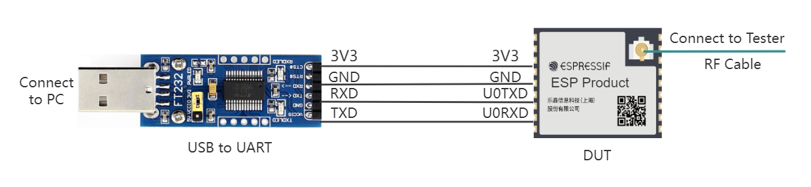
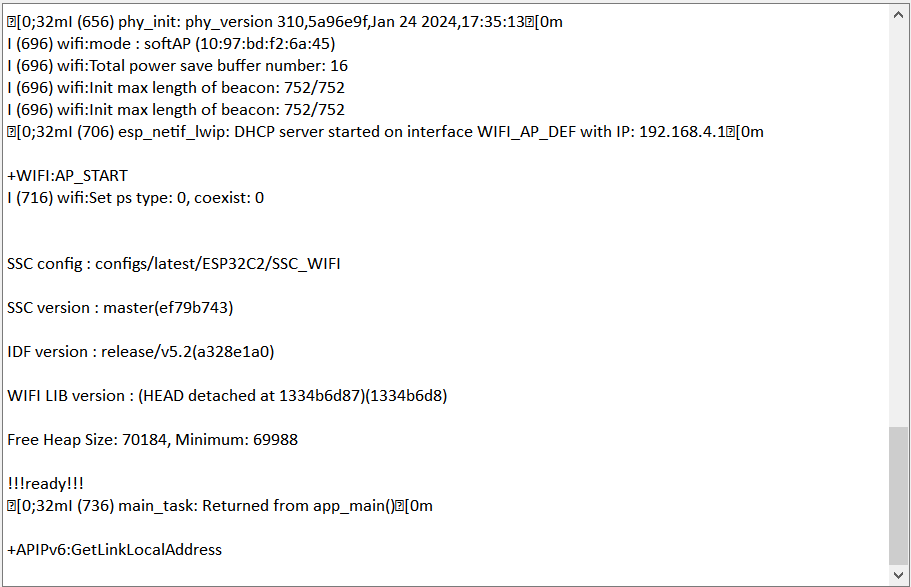
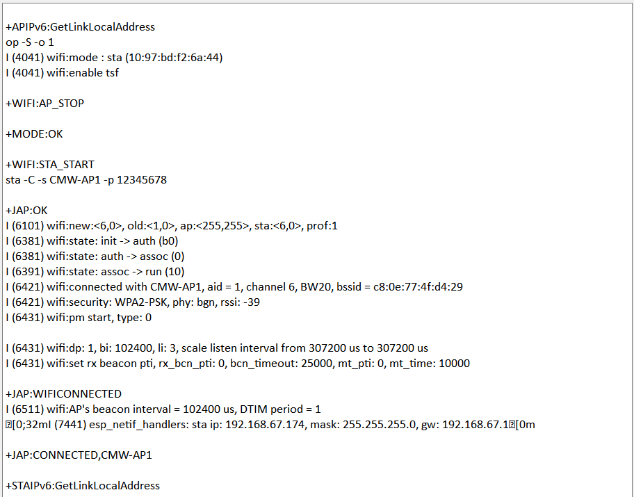

Wi-Fi Blocking Test
==============================

:link_to_translation:`zh_CN:[中文]`

The Wi-Fi Blocking Test (RX Blocking) is used to evaluate the receiving capability of the device under test (DUT) in the presence of external interference, mainly for CE certification.

Setting Up the Test Environment
-------------------------------

    UART Connection Description

The **Device Under Test (DUT)** is a product designed based on Espressif chips or modules. The DUT is connected to the USB-to-UART converter board via UART.

.. note::

    - The CHIP_EN pin of the DUT is pulled up by default. If it is not pulled high in the product design, you need to manually connect CHIP_EN to the 3V3 pin.
    - Some serial communication boards have already swapped RXD and TXD internally, so no reverse connection is needed. Adjust the wiring according to the actual situation.
    - Espressif chips have a power-on self-calibration function, so before testing the DUT, the RF connection line must be connected to the test instrument.

Firmware Burning
------------------

{IDF_TARGET_WIFI_RX_BLOCKING_FIRMWARE:default="Not updated", esp32="`ESP32 Wi-Fi Blocking Test Firmware <https://dl.espressif.com/rf/esp32/ESP32_wifi_Adaptivity&Blocking_20210420.bin>`__", esp32c2="`ESP32-C2 Wi-Fi Blocking Test Firmware <https://dl.espressif.com/rf/esp32c2/ESP32C2_WiFi_Adaptivity&Blocking_26M_20240416.bin>`__", esp32c3="`ESP32-C3 Wi-Fi Blocking Test Firmware <https://dl.espressif.com/rf/esp32c3/ESP32C3_wifi_Adaptivity&Blocking_20220627.bin>`__", esp32c6="`ESP32-C6 Wi-Fi Blocking Test Firmware <https://dl.espressif.com/rf/esp32c6/ESP32C6_wifi_Adaptivity&Blocking_20230704.bin>`__", esp32s2="`ESP32-S2 Wi-Fi Blocking Test Firmware <https://dl.espressif.com/rf/esp32s2/ESP32S2_wifi_Adaptivity&Blocking_20220826.bin>`__", esp32s3="`ESP32-S3 Wi-Fi Blocking Test Firmware <https://dl.espressif.com/rf/esp32s3/ESP32S3_wifi_Adaptivity&Blocking_20230328.bin>`__", esp8266="`ES8266 Wi-Fi Blocking Test Firmware <https://dl.espressif.com/RF/ESP8266&8285_adaptivity&blocking_bin_20220824_115200.bin>`__"}

{IDF_TARGET_FLASH_ADDRESS:default="0x0", esp32="0x1000", esp32s2="0x1000"}

1. Open the DownloadTool.

2. Set the ChipType, Com Port, Baud Rate, click Open, and select Download to Flash.

3. Burn {IDF_TARGET_WIFI_RX_BLOCKING_FIRMWARE} to {IDF_TARGET_FLASH_ADDRESS} via UART.

After the burning is completed, continue with the following steps for the adaptivity test.

Start Testing
---------------------------

Check Power-on Print
^^^^^^^^^^^^^^^^^^^^^

Use a serial communication tool, such as `Friendly Serial Assistant <http://alithon.com/downloads>`_, configure the port number, set the baud rate to 115200, and if the serial port prints similar information after the device under test is powered on again, you can confirm that the test status is OK:

    Device power-on serial port print log

Next, you can choose to `Testing with Serial Port Commands`_ or `Testing with EspRFTestTool`_.

Testing with Serial Port Commands
^^^^^^^^^^^^^^^^^^^^^^^^^^^^^^^^^

Enter the following commands in the serial port in order to network:

::

  \\Device networking
  \\Configure the prototype to enter station mode
  op -S -o 1

  \\Connect to AP, SSID is CMW-AP, password is 12345678
  sta -C -s CMW-AP -p 12345678

.. note::

    - The ``-p`` parameter is used to set the AP password. If the AP has no password, this parameter is not needed.

The serial port prints the following information, indicating that the connection is successful and the Wi-Fi Blocking Test can be performed.

    Device networking serial port print log

Testing with EspRFTestTool
^^^^^^^^^^^^^^^^^^^^^^^^^^^^^^^^^^^^^^^^^

- Open the `EspRFTestTool package <https://dl.espressif.com/RF/EspRFTestTool_v3.6_Manual.zip>`_, configure ChipType and COM, select the baud rate 115200, open the port, and select the WiFi Adaptivity test interface.

- In STA mode, enter AP ssid and AP pwd, and click Connect AP to connect.

- If a log similar to the following is printed, it indicates that the network is successful:

.. figure:: ../../../_static/rf_test_tool/wifi_adptive_connection.png
    :align: center
    :scale: 80%

    Device networking

After the network is successful, you can start the Wi-Fi Blocking Test.
