EspRFTestTool 工具包
=============================

EspRFTestTool 工具包是乐鑫提供的射频测试工具，包含 EspRFTestTool、DownloadTool 和 PowerLimitTool。

- EspRFTestTool_：主要用于相关射频测试；
- DownloadTool_：主要用于下载固件；
- PowerLimitTool_：可用于生成定制化 phy_init_data 固件。

.. _EspRFTestTool:

EspRFTestTool
---------------------------------

EspRFTestTool 工具包主界面就是 EspRFTestTool，包含串口配置、下载栏和射频测试区。

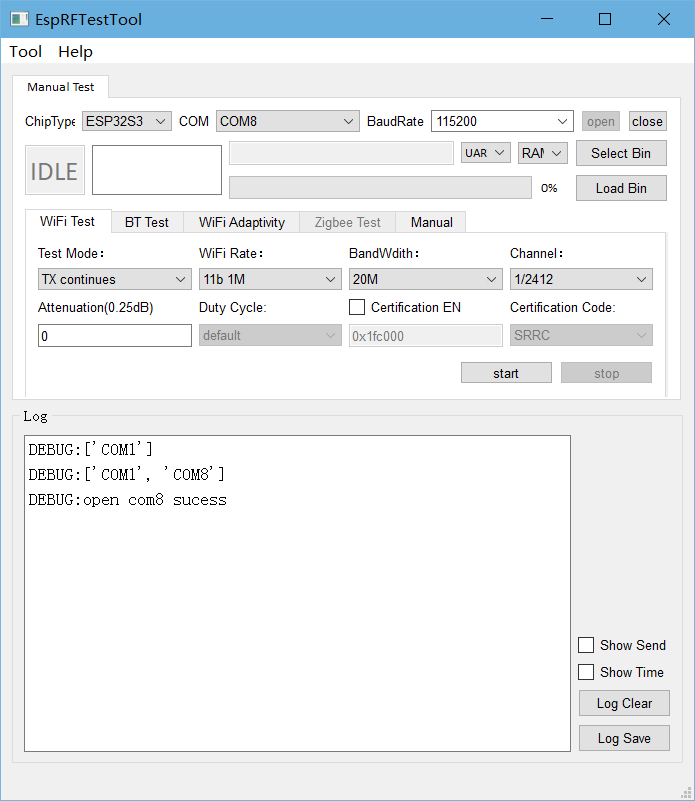

    EspRFTestTool 主界面

配置好串口后，可进行快速烧录和射频测试功能。

- **下载栏**
  如烧录射频定频测试固件或自适应测试固件，可直接使用此处的下载栏快速烧录：

  * 拉低 Boot 健后对芯片重新上电使芯片进入下载模式；
  * 选择烧录至 Flash 中，默认使用 UART 方式，点击 Select Bin 选择要烧录的 Bin 文件，点击 Load Bin 即可开始烧录；
  * 烧录完成后，拉高 Boot 健后对芯片重新上电使芯片进入工作模式。

.. figure:: ../../../_static/rf_test_tool/esprftesttool_download.png
    :align: center
    :scale: 80%

    EspRFTestTool 下载栏

- **射频测试区**

  已烧录固件可进行相应的射频测试：

  * Wi-Fi Test：用于 Wi-Fi 定频测试和认证；
  * BT Test：用于 BT/BLE 定频测试和认证；
  * Wi-Fi Adaptivity：用于 Wi-Fi 自适应认证测试；
  * Zigbee Test：用于 Zigbee 定频测试和认证；
  * Manual：可用于串口指令输入；

  Log 窗口中用于展示工具状态，如需查看芯片串口打印 log，请使用通用串口助手。

.. _DownloadTool:

DownloadTool
---------------------------------

在工具栏中点击 Tool，选择 DownloadTool，进入 DownloadTool 工具界面。

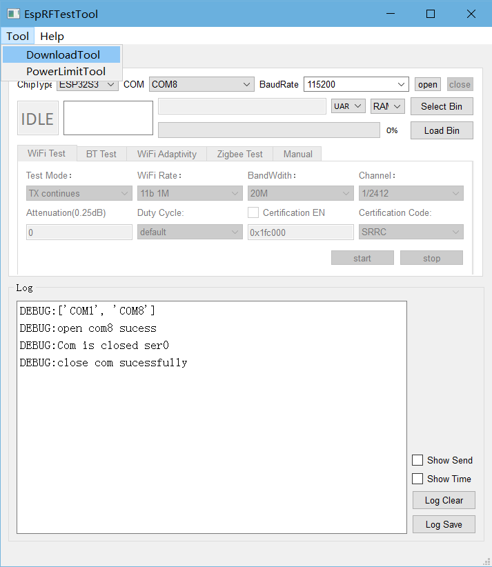

    进入 DownloadTool

选择芯片类型，配置好串口后，打开 COM 口，选择烧录到 Flash 中，此时可调整烧录地址，选择要烧录的固件。

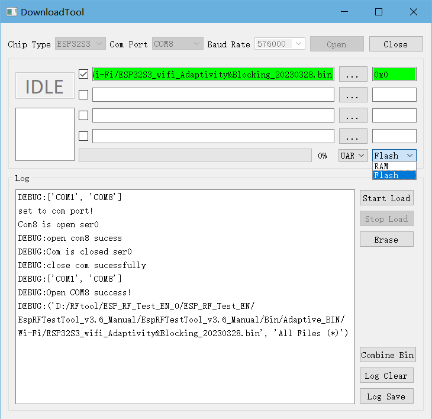

    DownloadTool 界面

确认芯片已进入下载模式，点击 Start Load 开始烧录，烧录完成后显示 SUCC 标志。

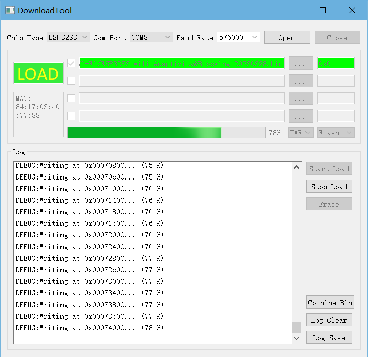

    DownloadTool 烧录

.. note::

  如何确认芯片进入下载模式：

  1. 关闭 DownloadTool 串口，打开通用串口助手，如友善串口助手（下载页：http://alithon.com/downloads）；
  2. 配置串口号和波特率，拉低 Boot 健，芯片重新上电，串口助手中会打印 waitting for download 等 log;
  3. 关闭串口助手，打开 DownloadTool，可开始烧录；
  4. 烧录完成后，拉高 Boot 健，芯片重新上电，可进入工作模式，如异常，使用串口助手确认。

.. _PowerLimitTool:

PowerLimitTool
---------------------------------

PowerLimitTool 可用于配置 Wi-Fi 输出功率，生成包括单国和多国的 phy init bin 文件, 满足客户产品在不同国家或地区的法规需求。

.. note::

  Wi-Fi 功率限制可使用以下几种方式，如多种方式共用，则取其功率的最小值：

  1. 使用 API (esp_wifi_set_max_tx_power) ，可限制最大输出功率；
  2. 在 Menuconfig 中配置 Max Wi-Fi TX Power，与上述 API 功能相同，可限制最大输出功率；
  3. 使用 Phy Init Bin 功能，在 IDF 中修改 phy_init_data.h 文件；
  4. 使用 Phy Init Bin 功能，生成 phy_init_data.bin 文件，参考本文介绍。

生成 phy_init_data.bin 文件
^^^^^^^^^^^^^^^^^^^^^^^^^^^^^^^^^^^

在 ESPRFTestTool 主界面下，点击 Tool，选择下拉框中的 PowerLimitTool，打开 PowerLimitTool 工具。

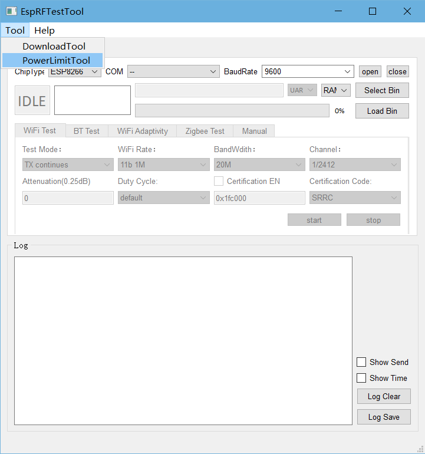

    PowerLimitTool 工具入口

进入 PowerLimitTool 主界面，Chip 下拉框中显示当前工具版本支持的芯片型号，选择对应的芯片（以 ESP32-C3 为例）。

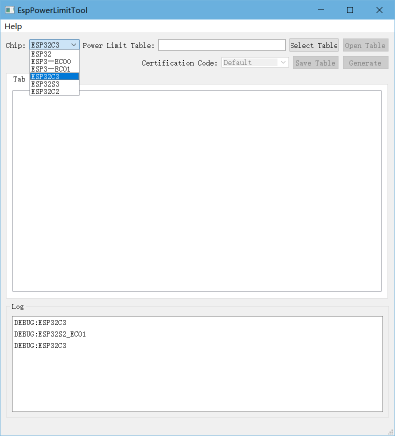

    PowerLimitTool 工具主界面

点 Slect Table，选择对应芯片的 TX_Power_Setting 。

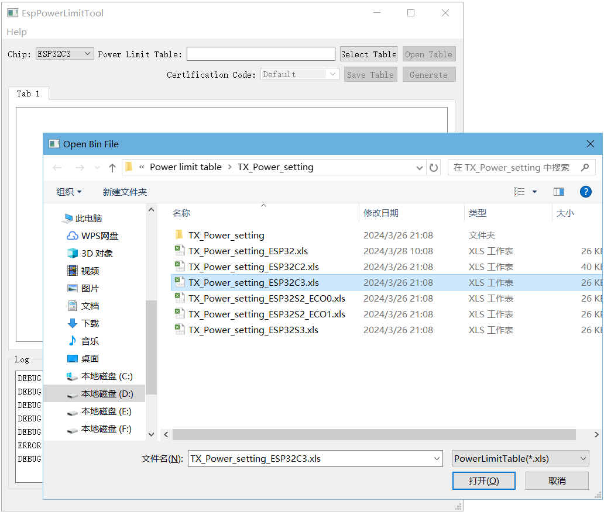

    导入 TX_Power_Setting

.. note::

  TX_Power_Setting 说明：

  1. Config_Switch: 使能 Power_By_Rate 和 Power_Limit，默认均选择 Yes, 表示均可调整；
  2. PowerByRate_TargetPower: 各速率目标功率，建议保持默认值；
  3. Country_Table：当前默认支持的国家（地区），可扩展；
  4. Actual_Result：模组实测功率，默认使用目标功率；
  5. Default：国家码中“Default”功率配置，通常用于识别国家码前的功率配置；
  6. SRRC_1：国家码中“SRRC”的功率配置，适用于中国大陆；
  7. FCC_2：国家码中“SRRC”的功率配置，适用于美国；
  8. CE_3：国家码中“CE”的功率配置，适用于欧洲；
  9. NCC_4：国家码中“NCC”的功率配置，适用于台湾地区；
  10. KCC_5：国家码中“KCC”的功率配置，适用于韩国；
  11. MIC_6：国家码中“MIC”的功率配置，适用于日本；
  12. IC_7：国家码中“IC”的功率配置，适用于加拿大；

点击 Open Table, 在对应国家码表中修改期望的功率值，在 Certification Code 下拉框中选择期望的国家码。

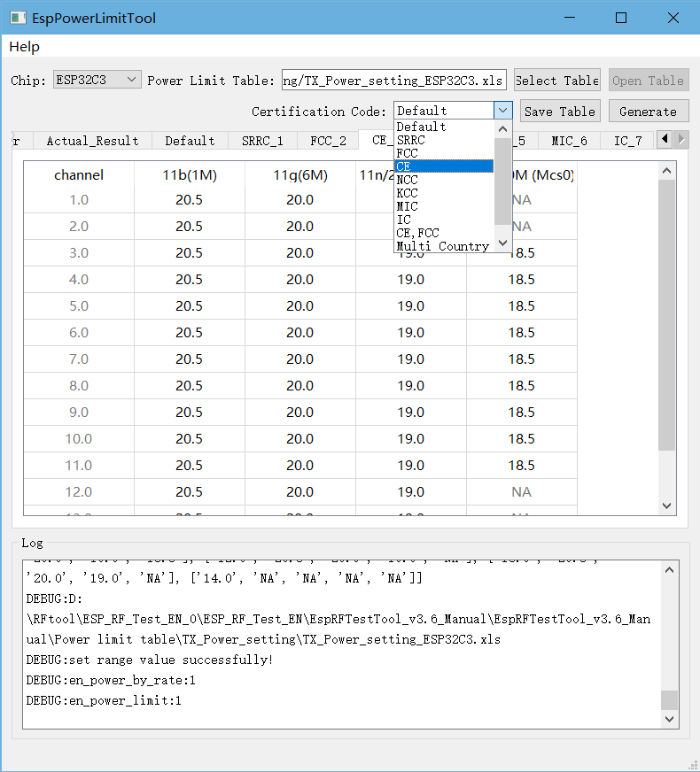

    修改 TX_Power_Setting

.. note::

  关于如何修改功率值：

  1. 根据认证结果（认证提供功率衰减值）填写功率值（功率值 = 目标功率 - 衰减值/4）；
  2. 如果修改了 Actual_Result，上述公式中的目标功率需改为 Actual_Result ；
  3. 不能增删表格内容，如 FCC 仅支持1~11信道，此表中12~13信道功率值建议与信道11保持相同，但不可删除；
  4. 除低高信道外，其他中间信道功率值可设置与中间信道保持一致；
  5. NA 的部分不可修改，如 Certification Code 无法下拉选择，表明表格被改动，需还原。

点击 Save Table 保存设置，点击 Generate 生成对应国家码的 phy_init_bin 文件。

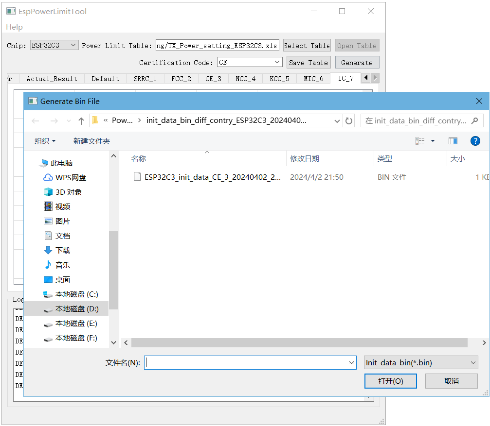

    生成 phy_init_bin 文件

使用 RF 定频测试
^^^^^^^^^^^^^^^^^^^^^^^^^^^^^^^^^^^
在 ESPRFTestTool 主界面下，点击 Tool，选择下拉框中的 DownloadTool，打开 DownloadTool 工具。

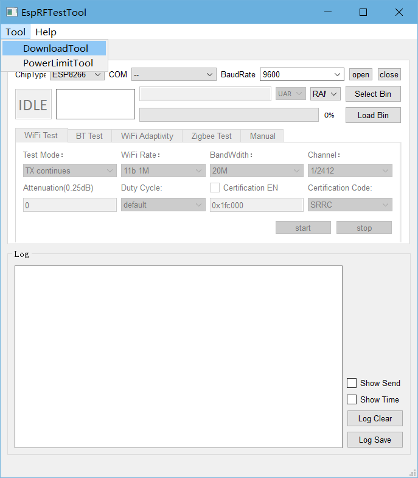

    DownloadTool 工具入口

在 DownloadTool 主界面下，选择 ChipType，Com Port，Baud Rate，点击 Open，选择下载到 Flash。

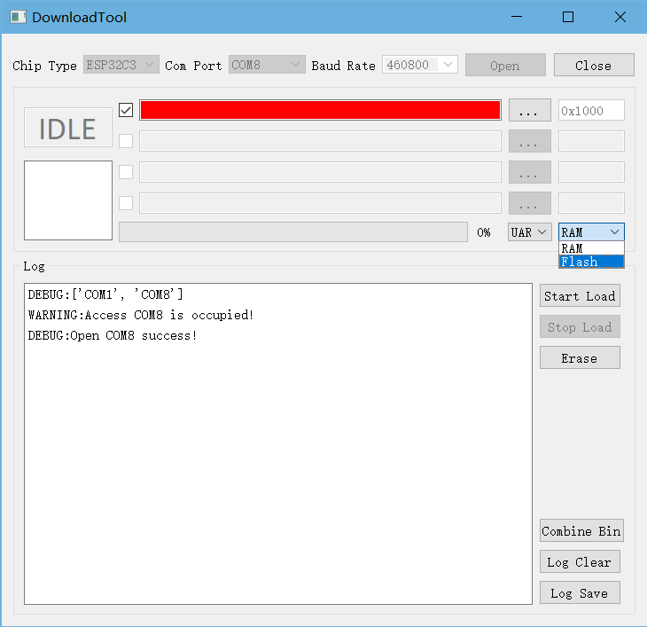

    DownloadTool 工具界面

选择 RF Test bin 和 phy init bin，通过 UART 一起烧录至指定地址。

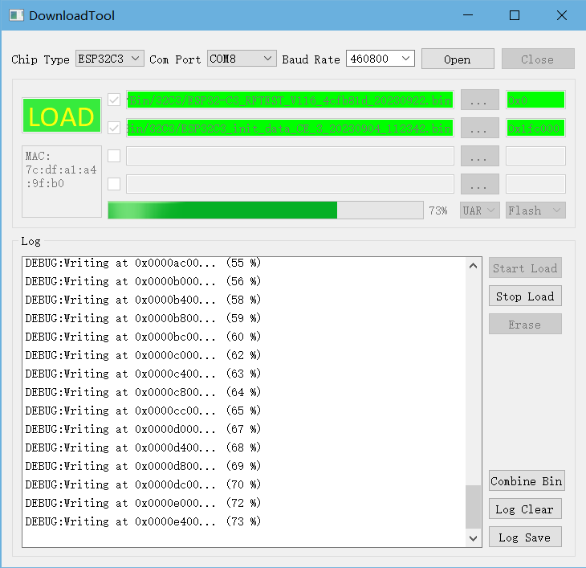

    烧录定频固件

.. note::

  1. 对于 ESP32 和 ESP32S2，RF bin 烧录至 0x1000，其他芯片烧录至 0x0；
  2. phy_init_bin 烧录至 0x1fc000 用于非信令工具测试。

- 烧录完成后，点击串口配置中的 CLose，关闭 DownloadTool 串口，关闭工具窗口进入 RF 测试界面；
- 次选择 ChipType，COM，BaudRate，点击 open 打开串口；
- 在 WiFi Test 界面框中，选择 Test Mode 为 TX Packet，选择对应速率和信道，点击 start 发包。
- 使用综测仪确认未使能 phy_init_bin 时的输出功率。

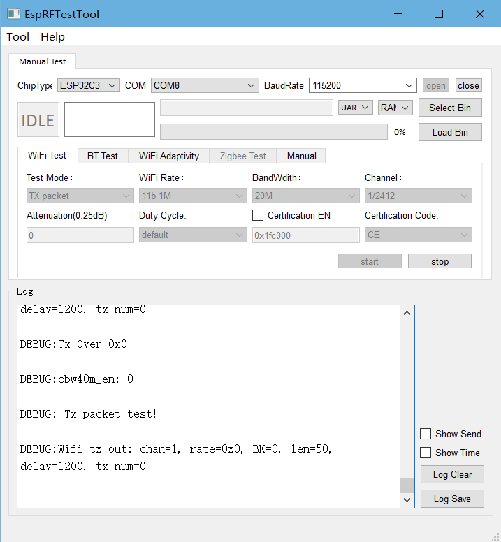

    未使用 phy_init_bin 发包

.. note::

  1. 启用 phy_init_bin 前确认输出功率，用于验证 phy_init_bin 是否生效；
  2. 使用 tx packet 而非 tx continue 验证输出功率。

点击 stop 停止发包，点击 Certification EN 复选框，使能 phy_init_bin，点击 start 发包。

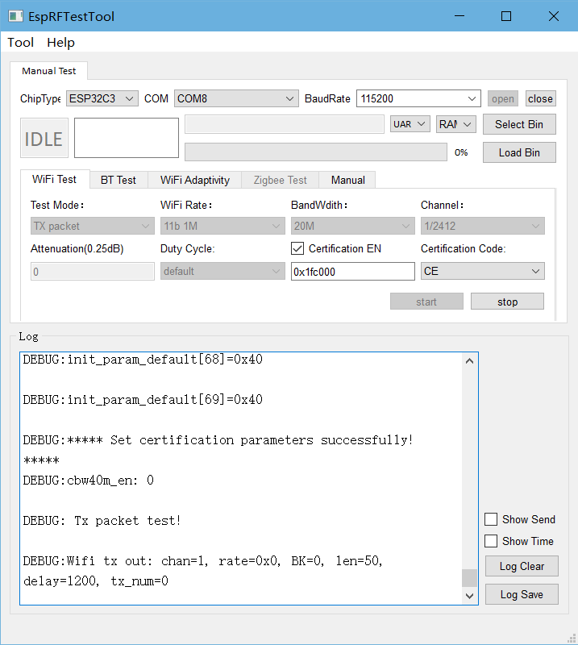

    使能 phy_init_bin 发包

.. note::

  1. 点击 Certification EN 使能或禁用 phy_init_bin 时均须停止发包后操作；
  2. 默认 phy_init_bin 使能地址为 0x1fc000, 可修改，需同步修改对应烧录地址；
  3. 使能 phy_init_bin 后可选择对应的 Certification Code 切换不同国家。

使用信令测试
^^^^^^^^^^^^^^^^^^^^^^^^^^^^^^^^^^^
在 DownloadTool 工具配置串口，选择信令测试固件中各个 bin 文件，配置烧录地址，下载到 Flash 中。

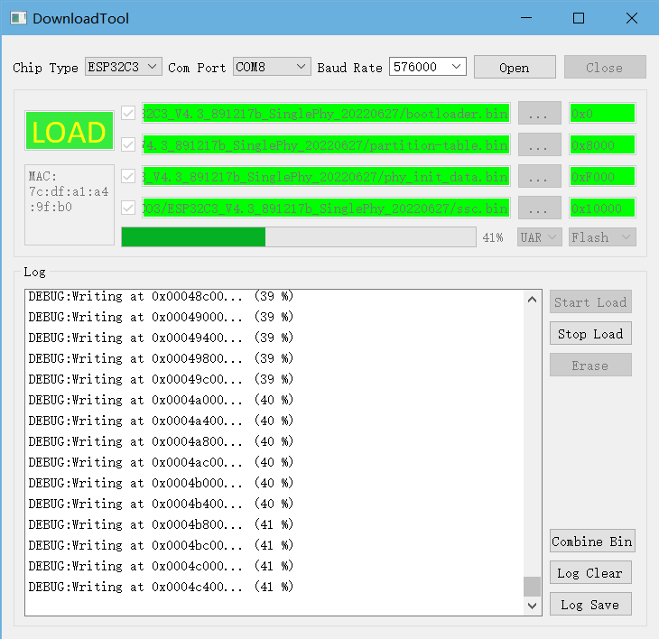

    DownloadTool 烧录界面

.. note::

  1. phy_init_bin 信令中默认地址为 0xF000；
  2. 如需使用多国 phy_init_bin 功能，需使用带有多国 phy_init_bin 的信令固件，或在 menuconfig 中配置后重新编译；
  3. 对于 ESP32 和 ESP32S2，bootloader 烧录至 0x1000，其他芯片烧录至 0x0；
  4. 烧录波特率设置建议低于 921600。

.. only:: not esp32h2

    :doc:`../rf_test_items/wifi_signaling_test`

关闭 ESP 工具串口，打开通用串口工具，具体可参考 wifi_signaling_test。
使用多国 phy_init_bin，在 AP 中调整国家码信息后，ESP 产品将自动切换为对应国家的功率配置。

