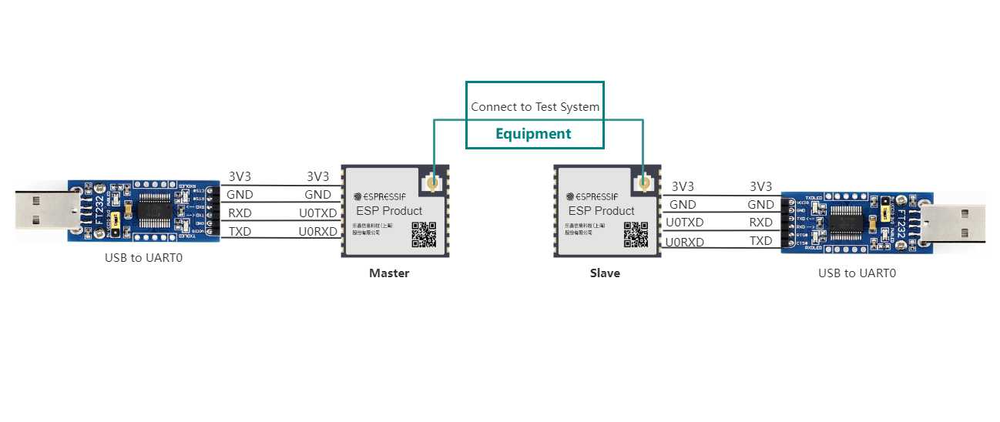

低功耗蓝牙自适应测试
=================================

:link_to_translation:`en:[English]`

在 BLE 以跳频方式工作且 PSD 大于 10dBm/MHz时，需满足 CE，SRRC 等认证自适应测试的需求。

.. note:: 
  - BLE PSD 低于 10dBm/MHz 时，可选择基于等效占用率豁免自适应测试；
  - BLE PSD 高于 10dBm/MHz 时，可选择基于跳频的发射前搜寻机制（LBT）做自适应测试。

测试准备
---------------------------

硬件连接
^^^^^^^^^^^^^^^^^^^^^

    BLE Adaptivity Test 连接说明

使用串口板与 ESP 产品串口连接：

- 待测设备 (DUT) CHIP_EN 需默认上拉，如产品设计中未拉高，需将 CHIP_EN 接到 3V3;
- 部分串口通信板内部已交换 RXD 和 TXD, 无需反接，需根据实际情况调整接线;
- ESP 芯片具有上电自校准功能，因此 DUT 需先将射频连接线接好后再上电开始测试；
- BLE Adaptivity 测试中使用 ESP 模组作为配测设备（Slave）与待测设备（Master）建立连接；
- Test System 指自适应测试系统，待 Master 与 Slave 连接成功后即可开始测试;
- Slave 与 Master 烧录相同的固件，使用串口指令区分。

BLE DTM 测试固件烧录
^^^^^^^^^^^^^^^^^^^^^

.. only:: esp32c2

  - 请参考 EspRFTestTool 工具包中的 DownloadTool 章节，并烧录 ESP32C2_BLE_Adaptivity_BIN，烧录地址：0x0。

.. only:: esp32c3

  - 请参考 EspRFTestTool 工具包中的 DownloadTool 章节，并烧录 ESP32C3_BLE_Adaptivity_BIN，烧录地址：0x0。
  
.. only:: esp32c6

  - 请参考 EspRFTestTool 工具包中的 DownloadTool 章节，并烧录 ESP32C6_BLE_Adaptivity_BIN，烧录地址：0x0。

.. only:: esp32s3

  - 请参考 EspRFTestTool 工具包中的 DownloadTool 章节，并烧录 ESP32S3_BLE_Adaptivity_BIN，烧录地址：0x0。

.. only:: esp32h2

  - 请参考 EspRFTestTool 工具包中的 DownloadTool 章节，并烧录 ESP32H2_BLE_Adaptivity_BIN，烧录地址：0x0。

已烧录固件的样机，可继续往下进行 BLE Adaptivity 测试。

BLE Adaptiviy 测试
---------------------------
BLE Adaptivity 测试需在 Mater 与 Slave 设备中输入相应串口指令建立连接后测试。
依次在 Slave 和 Master 设备输入相应指令：

Slave 设备
::

  bleadve -C -z start -t 19 -u 13

Master 设备
::

  bleconn -T -z start -x 1 -y 1 -n 1 -i 0x6-0x6 -v 13
  ble -S -z etxp -t 4 -h 1 -e 13
  gattc -C -m 512 -p 0x10 -r c0:11:11:11:11:11 -b 1
  gattc -W -z char -p 0x10 -s 0xA002 -c 0xC317 -l 490 -n 0xFFFFFFFF -w 1 -r c0:11:11:11:11:11 -g 1 -b 1

上述指令输入完成后即可开始 BLE Adaptivity 测试。

上述串口指令分别表示：

Slave 设备

- 开启配测设备广播；

Master 设备

- 建立连接,配置速率为1Mbps（如需配置为 2Mbps，参数修改为 -x 2 -y 2），设置功率等级（-v 13）； 
- 配置功率，默认设置为 13 档（-e 后参数和上一条指令 -v 后参数保持一致）；
- 设置 MTU
- 发送数据

其他操作
如需断开连接，输入串口指令：
::

  bleconn -D -z all 

如需重启模组，输入串口指令：
::

  reboot

.. note:: 
  - 如需测试广播及数据跳频，请联系 ESP 工程师。
