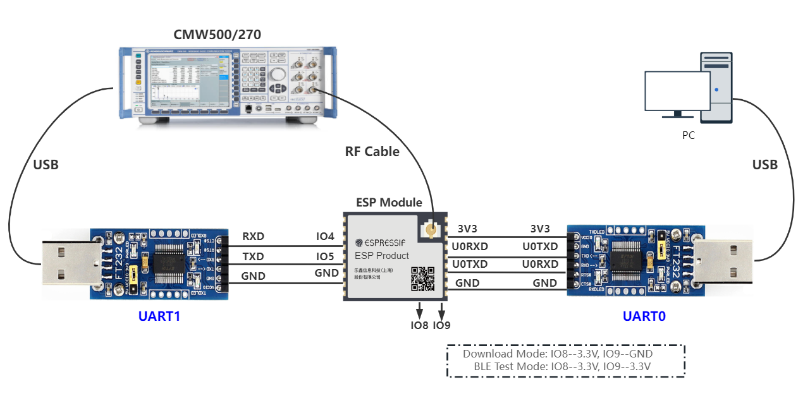

低功耗蓝牙 DTM 测试
===============================

:link_to_translation:`en:[English]`

低功耗蓝牙 DTM 测试主要用于 BLE BQB 认证 和 CE 等相关认证测试项。

测试准备
---------------------------

硬件连接
^^^^^^^^^^^^^^^^^^^^^

    DTM UART1 连接说明

使用串口板与 ESP 产品串口连接：

- 待测设备 (DUT) CHIP_EN 需默认上拉，如产品设计中未拉高，需将 CHIP_EN 接到 3V3;
- 部分串口通信板内部已交换 RXD 和 TXD, 无需反接，需根据实际情况调整接线;
- ESP 芯片具有上电自校准功能，因此 DUT 上电测试前需先将射频连接线连接至综测仪;
- BLE DTM 测试中的 Tester 或 Test System 通常使用 CMW500 或 CBT 等蓝牙仪器。

BLE DTM 测试固件烧录
^^^^^^^^^^^^^^^^^^^^^

.. only:: esp32c2

  - 请参考 EspRFTestTool 工具包中的 DownloadTool 章节，并烧录 ESP32C2_BLE_DTM_BIN。

.. only:: esp32c3

  - 请参考 EspRFTestTool 工具包中的 DownloadTool 章节，并烧录 ESP32C3_BLE_DTM_BIN。
  
.. only:: esp32c6

  - 请参考 EspRFTestTool 工具包中的 DownloadTool 章节，并烧录 ESP32C6_BLE_DTM_BIN。

.. only:: esp32s3

  - 请参考 EspRFTestTool 工具包中的 DownloadTool 章节，并烧录 ESP32S3_BLE_DTM_BIN。

.. only:: esp32h2

  - 请参考 EspRFTestTool 工具包中的 DownloadTool 章节，并烧录 ESP32H2_BLE_DTM_BIN。

Flash 烧录地址：

::
    
    bootloader.bin:       0x0
    partition-table.bin   0x8000
    ssc.bin               0x10000

已烧录固件的样机，可继续往下进行 BLE DTM 测试。

BLE DTM 测试
---------------------------
BLE DTM 测试根据 UART1 的连接方式分为 HCI 和 2-wire 两种，默认使用 HCI 方式。

HCI
^^^^^^^^^^^^^^^^^^^^^
依照上述硬件连接方式，可通过 UART0 串口打印信息确认固件烧录成功；
上电默认以 Power 12dBm，无流控，波特率115200 完成初始化过程，无需输入指令，可直接开始 DTM 测试；

如需调整 UART1 的相关设置，可通过 UART0 端输入相应的指令实时调整：

::

    bqb -z reconfig_uart1_pin -t 4 -r 5
    bqb -z set_ble_tx_power -i 15
    bqb -z set_uart_param -f 0 -b 115200

分别表示：

- 配置 UART1，调整 TX 为 GPIO4, 调整 RX 为 GPIO5； 
- 配置 TX 输出功率，支持 0~15 档功率调整； 
- 配置流控关闭，波特率设置为 115200。

