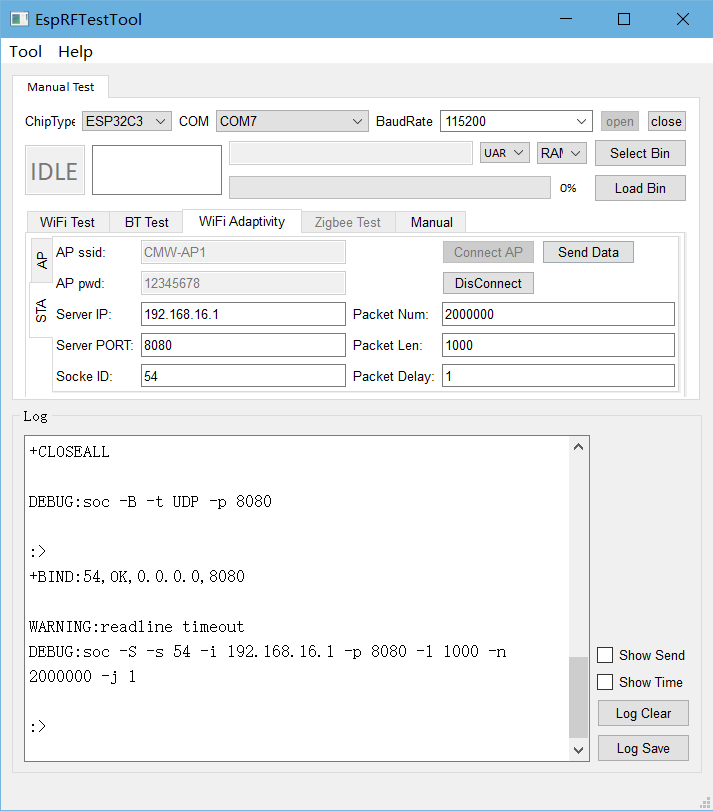

Wi-Fi 自适应测试
==============================

:link_to_translation:`en:[English]`

Wi-Fi 自适应（Adaptivity）测试是一种评估 WI-Fi 设备在干扰环境下的主动适应能力的方法，主要用于 SRRC、CE 等认证。

.. note:: 

  Wi-Fi PSD 高于 10dBm/MHz 时，自适应选择基于负载非跳频的发射前搜寻机制（LBT）。

测试准备
---------------------------

硬件连接
^^^^^^^^^^^^^^^^^^^^^

.. figure:: ../../../_static/rf_test_tool/usb_to_uart_connection3.png
    :align: center
    :scale: 80%

    UART 连接说明

使用串口板与 ESP 产品串口连接：

- 待测设备 (DUT) CHIP_EN 需默认上拉，如产品设计中未拉高，需将 CHIP_EN 接到 3V3。
- 部分串口通信板内部已交换 RXD 和 TXD, 无需反接，需根据实际情况调整接线。
- ESP 芯片具有上电自校准功能，因此 DUT 上电测试前需先将射频连接线连接至综测仪。

WI-Fi 测试固件烧录
^^^^^^^^^^^^^^^^^^^^^
.. only:: esp32

  - 请参考 EspRFTestTool 工具包中的 DownloadTool 章节，并烧录 ESP32_Wi-Fi_Adaptive_BIN，烧录地址：0x1000。

.. only:: esp32c2

  - 请参考 EspRFTestTool 工具包中的 DownloadTool 章节，并烧录 ESP32C2_Wi-Fi_Adaptive_BIN，烧录地址：0x0。

.. only:: esp32c3

  - 请参考 EspRFTestTool 工具包中的 DownloadTool 章节，并烧录 ESP32C3_Wi-Fi_Adaptive_BIN，烧录地址：0x0。

.. only:: esp32c6

  - 请参考 EspRFTestTool 工具包中的 DownloadTool 章节，并烧录 ESP32C6_Wi-Fi_Adaptive_BIN，烧录地址：0x0。

.. only:: esp32s2

  - 请参考 EspRFTestTool 工具包中的 DownloadTool 章节，并烧录 ESP32S2_Wi-Fi_Adaptive_BIN，烧录地址：0x1000。

.. only:: esp32s3

  - 请参考 EspRFTestTool 工具包中的 DownloadTool 章节，并烧录 ESP32S3_Wi-Fi_Adaptive_BIN，烧录地址：0x0。

.. only:: esp8266

  - 请参考 EspRFTestTool 工具包中的 DownloadTool 章节，并烧录 ESP8266_Wi-Fi_Adaptive_BIN，烧录地址：0x0。

- 已烧录固件的样机，可继续往下进行自适应测试。

WI-Fi 自适应测试
---------------------------

查看上电打印
^^^^^^^^^^^^^^^^^^^^^
使用串口通信工具，如友善串口助手（下载页：http://alithon.com/downloads）。
配置端口号，波特率选择 115200，ESP 重新上电后串口打印如下类似信息，表明测试固件 OK：

.. figure:: ../../../_static/rf_test_tool/esp32c2_wifi_signaling.png
    :align: center
    :scale: 80%

    Wi-Fi 自适应上电串口打印日志

.. _wifi-adaptivity-test:

Wi-Fi 自适应测试可选择使用串口指令或者使用射频测试工具任意一种方式：

使用串口指令测试
^^^^^^^^^^^^^^^^^^^^^
在串口中依次输入以下指令完成配网、跑流等过程：

::

  op -S -o 1    \\配置样机进入 station 模式
  sta -C -s CMW-AP -p 12345678    \\连接AP，SSID 为 CMW-AP ，密码为12345678

  soc -T    \\清空 socket
  soc -B -t UDP -p 8080   \\创建 UDP, 端口为 8080，默认 socket ID 为 54
  soc -S -s 54 -i 192.168.1.1 -p 8080 -l 2000 -n 200000000 -j 1   \\对 socket ID 为54的 AP 设备跑流

串口中打印如下信息，表明跑流成功，可开始自适应测试。

.. figure:: ../../../_static/rf_test_tool/wifi_adptive_log.png
    :align: center
    :scale: 80%

    Wi-Fi 自适应测试串口打印日志

使用 EspRFTestTool 工具测试
^^^^^^^^^^^^^^^^^^^^^^^^^^^^^^^^^^^^^^^^^
打开 EspRFTestTool，配置 ChipType 和 COM，波特率选择 115200，打开端口后， 选择 WiFi Adaptivity 测试界面；
在 STA 模式输入 AP SSID 和 AP Password, 点击 Connect AP 连接，连接成功后显示如下打印：

.. figure:: ../../../_static/rf_test_tool/wifi_adptive_connection.png
    :align: center
    :scale: 80%

    Wi-Fi 自适应测试与 AP 建立连接

连接成功后将 Pakcet Num 设置为一个足够大的数值，如 20000000，以满足较长跑流时间；Port 为 8080, Socket ID 为 54, 将 Packet Delay 改为 1, 以满足认证需求。

上述设置完成后，点击 Send Data, 工具打印如下 log，跑流成功，可开始自适应测试。

    Wi-Fi 自适应开启跑流
