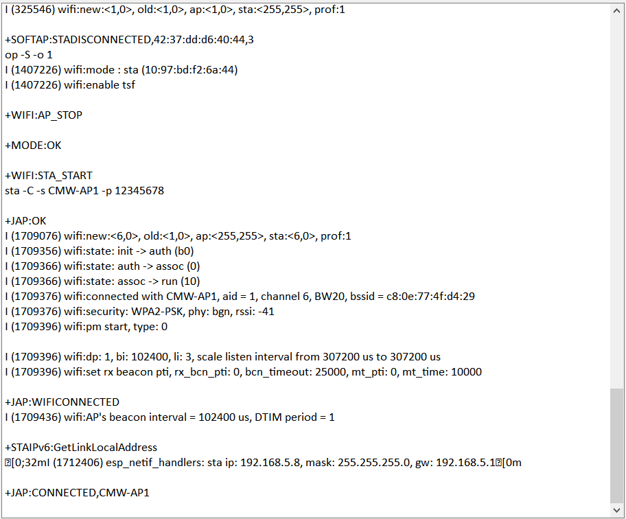

Wi-Fi 信令测试
==============================

:link_to_translation:`en:[English]`

Wi-Fi 信令测试主要用于 Wi-Fi 信令功能验证，可用于 OTA（TRP 和 TIS）测试。

测试准备
---------------------------

硬件连接
^^^^^^^^^^^^^^^^^^^^^

.. figure:: ../../../_static/rf_test_tool/usb_to_uart_connection2.png
    :align: center
    :scale: 80%

    UART 连接说明

使用串口板与 ESP 产品串口连接：

- 待测设备 (DUT) CHIP_EN 需默认上拉，如产品设计中未拉高，需将 CHIP_EN 接到 3V3。
- 部分串口通信板内部已交换 RXD 和 TXD, 无需反接，需根据实际情况调整接线。
- ESP 芯片具有上电自校准功能，因此 DUT 上电测试前需先将射频连接线连接至综测仪。

WI-Fi 测试固件烧录
^^^^^^^^^^^^^^^^^^^^^
.. only:: esp32

  - 请参考 EspRFTestTool 工具包中的 DownloadTool 章节，并烧录 ESP32_Wi-Fi_Signaling_BIN。

.. only:: esp32c2

  - 请参考 EspRFTestTool 工具包中的 DownloadTool 章节，并烧录 ESP32C2_Wi-Fi_Signaling_BIN。

.. only:: esp32c3

  - 请参考 EspRFTestTool 工具包中的 DownloadTool 章节，并烧录 ESP32C3_Wi-Fi_Signaling_BIN。

.. only:: esp32c6

  - 请参考 EspRFTestTool 工具包中的 DownloadTool 章节，并烧录 ESP32C6_Wi-Fi_Signaling_BIN。

.. only:: esp32s2

  - 请参考 EspRFTestTool 工具包中的 DownloadTool 章节，并烧录 ESP32S2_Wi-Fi_Signaling_BIN。

.. only:: esp32s3

  - 请参考 EspRFTestTool 工具包中的 DownloadTool 章节，并烧录 ESP32S3_Wi-Fi_Signaling_BIN。

.. only:: esp8266

  - 请参考 EspRFTestTool 工具包中的 DownloadTool 章节，并烧录 ESP8266_Wi-Fi_Signaling_BIN。

Flash 烧录地址：

.. only:: esp32 or esp32s2

    bootloader.bin:       0x1000
    partition-table.bin   0x8000
    phy_init_data.bin     0xF000
    ssc.bin               0x10000

.. only:: not esp32c2 or esp32c3 or esp32c6 or esp32s3 or esp32h2

    bootloader.bin:       0x0
    partition-table.bin   0x8000
    phy_init_data.bin     0xF000
    ssc.bin               0x10000

- 已烧录固件的样机，可继续往下进行信令测试。

.. _wifi-signalling-test:

WI-Fi 信令测试
---------------------------

查看上电打印
^^^^^^^^^^^^^^^^^^^^^
使用串口通信工具，如友善串口助手（下载页：http://alithon.com/downloads），
配置端口号，波特率选择 115200，ESP 重新上电后串口打印类似信息，确认测试状态 OK：

.. figure:: ../../../_static/rf_test_tool/esp32c2_wifi_signaling.png
    :align: center
    :scale: 80%

    Wi-Fi 信令上电串口打印日志

输入配网指令
^^^^^^^^^^^^^^^^^^^^^
在串口中依次输入以下两条指令完成配网：
::

  op -S -o 1
  sta -C -s CMW-AP 

如需配置加密（默认加密方式为 WPA2-Personal）, 则输入：
::

  op -S -o 1
  sta -C -s CMW-AP -p 12345678

第一条指令为配置样机进入 station 模式;
第二条指令为连接 AP，SSID 为 CMW-AP ，密码为 12345678；

starion 设备分配到 IP 地址后，表明 WI-Fi 连接成功，如下图：

    Wi-Fi 信令连接串口打印日志

.. note:: 
  常见的 AP 设备除路由器外，射频测试常用 CMW500 或 CMW270，上述操作需要基于仪器正确的配置和操作。
